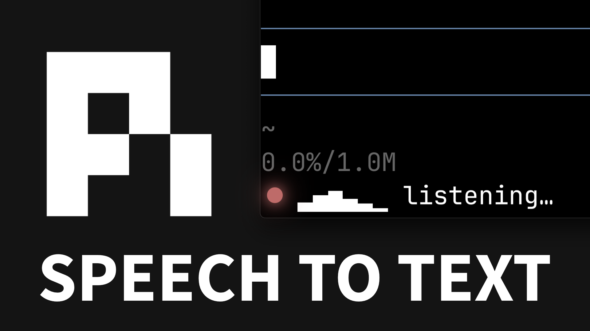

# dictate

Minimal voice dictation for pi. No floating bubbles, no menu bar app, no notifications.

- **Toggle:** `alt+m` by default (press to start, press again to stop) — works **anywhere in pi**, not just the main chat input: quiz popups, `ask_user_question`, `ctx.ui.editor()`/`input()` dialogs, selectors. The key is intercepted at the TUI input layer, before whatever component has focus. Customizable via the `dictate.toggleKey` setting.
- **Cancel:** `alt+n` by default (discard the in-flight transcript; safe to press anytime, no-op when no dictation is in flight). Customizable via the `dictate.cancelKey` setting.
- **Where text goes:** to whatever input field is focused **when you stop** (never replaces, always appends):
  - Main chat editor or any `ctx.ui.editor()`/`input()` popup → appended directly.
  - Opaque dialogs (quiz / ask_user_question selects) → typed in as keystrokes. Their internal focus is invisible to the extension, so **Tab into the note/Other field first** — that's where the text will land.
  - Nothing text-capable focused → transcript is copied to the clipboard (via `pbcopy`, so macOS-only) and a notification says so. A finished dictation is never lost.
- **Start guard:** if no input field is focused when you press `alt+m`, dictation doesn't start and a notification explains why.
- **Live feedback:** while recording, the status row shows a red `●` plus a real-time mic-level meter (`● ▂▅▇ listening…`) — instant confirmation your mic is live. On stop it flips to a `finalizing…` spinner.
- **Language:** English by default. Switch with `/dictate-language <code>` — e.g. `/dictate-language ja`, `/dictate-language pt-BR`, or `multi` for multilingual code-switching. The command autocompletes all [nova-3 supported languages](https://developers.deepgram.com/docs/models-languages-overview#nova-3) by code or name (typing `jap` suggests `ja` · Japanese). While recording in a non-default language, the status row shows it: `● ▂▅▇ listening [ja]…`. `/dictate-language` with no args shows the current language.
- **Backend:** Deepgram Nova-3 streaming
- **What's "real-time":** audio is transcribed *while you talk*; the finalized text is inserted in one shot when you stop. Stop-to-display latency is typically ~300-500ms.

[](https://www.youtube.com/watch?v=gYxZt9Qe0fk)

## Install

```bash
pi install git:github.com/weibolu-rm/pi-dictate
```

Or manually: copy `index.ts` to `~/.pi/agent/extensions/dictate/index.ts`.

## One-time setup

```bash
brew install sox                              # provides `rec` for audio capture
export DEEPGRAM_API_KEY=dg_xxxxxxxxxxxxxxxx   # add to ~/.zshrc or ~/.bashrc
```

Sign up at https://console.deepgram.com — $200 free credit, no card. The Nova-3 streaming rate is ~$0.0077/min (~$0.46/hr).

## Usage

1. Focus any pi input field — the main chat input, a quiz note field, an `ask_user_question` answer box.
2. Press `alt+m`. The status row shows a red `●` with a live mic-level meter: `● ▁▂▃▅ listening…`. The bars move with your voice — if they stay flat, no audio is reaching the extension.
3. Talk.
4. Press `alt+m` again. The meter is replaced by a braille spinner (`⠋ finalizing…`), then the text appears in the focused input.

Focus is resolved fresh at stop time, so if a dialog opened (or focus moved) while you were talking, the text goes to whatever is focused at that moment.

Run `/reload` in pi after first install (or after editing `index.ts`) to pick up changes.

## How it works

- The extension spawns `rec` (sox) capturing 16kHz mono 16-bit PCM to stdout.
- It opens a Deepgram WebSocket and pipes the PCM stream in.
- Deepgram returns "final" results (per-utterance, stable) as you talk. Interim/partial results are disabled — the editor never shows revisable text.
- While recording, each audio chunk's RMS loudness is mapped to a bar glyph and shifted through a 6-cell ring every 60ms — the live level meter in the status row.
- On stop, the extension sends `{"type": "CloseStream"}`, waits for the server to flush, and concatenates all finals. (If Deepgram never closes the socket, a 3s timeout forces finalization.)
- **Focus-aware delivery:** the extension captures pi's `TUI` instance once (via an invisible zero-height widget) and installs a `tui.addInputListener` handler — listeners run *before* the focused component, which is why `alt+m` works inside dialogs (extension shortcuts are otherwise only matched by the main editor). Kitty-protocol key **release/repeat** events are filtered out, so one physical press toggles exactly once. On stop it inspects `tui.focusedComponent`: editor-like components (anything with `getText`/`setText`, including popups' inner `.editor`) get a direct append; opaque components get the text as synthetic keystrokes routed by their own focus logic.

## Customizing

### settings.json

Keybinds and the startup language live in settings.json — global (`~/.pi/agent/settings.json`) or per-project (`.pi/settings.json`, which overrides global) — under a `dictate` key:

```json
{
  "dictate": {
    "toggleKey": "alt+m",
    "cancelKey": "alt+n",
    "language": "en"
  }
}
```

- **Key strings** are pi-tui key identifiers: modifiers (`ctrl`, `shift`, `alt`, `super` — any order, case-insensitive) joined with `+` before a letter, digit, symbol, or special key name (`escape`, `enter`, `tab`, `f1`…`f12`, `up`/`down`/…). Unmodified printable keys (e.g. plain `m`) are rejected — they'd fire on every keystroke — but bare non-printing keys like `f6` work.
- **`language`** is a nova-3 language code (`en` by default) — the same codes `/dictate-language` autocompletes. `/dictate-language` overrides it for the current session only; this setting sets the startup default.
- Invalid values are ignored with a notification at session start, falling back per key: project → global → built-in default.

### index.ts knobs

For everything else, the knobs are at the top of `index.ts`:

- **Model:** edit `deepgramUrl()` — swap `model=nova-3` for `nova-2`, `enhanced`, etc.
- **Endpointing (how long a silence ends an utterance):** `endpointing=300` in the URL. Lower = faster finals, more fragmentation. Higher = slower finals, more coherent chunks.
- **Smart formatting / punctuation:** toggle `smart_format` and `punctuate` in the URL.
- **Level meter:** `METER_CELLS` (width in bars), `METER_TICK_MS` (update rate), `METER_FLOOR_DB` / `METER_CEILING_DB` (loudness range mapped to empty/full bars).

## Why `alt+m` / `alt+n` (and tmux)

The defaults are `alt`-based rather than `ctrl+shift`-based because **`ctrl+shift+<letter>` is not representable as a legacy terminal byte** — adding Shift to `Ctrl+M` doesn't change the byte, so `Ctrl+Shift+M` is indistinguishable from `Ctrl+M` (i.e. `\r` = Enter). That means inside **tmux** (which doesn't pass through the Kitty keyboard protocol, and only forwards modified keys when `extended-keys` is on — it's off by default), `ctrl+shift+m` would collapse to **Enter and submit your prompt**, and `ctrl+shift+n` would collapse to `Ctrl+N`.

`alt+<letter>` is safe because it has a distinct legacy byte (`Alt+M` → `ESC m`), which tmux forwards even without `extended-keys`. pi-tui matches this legacy form, so the binding works:

- inside tmux with default settings (the legacy `ESC m` form),
- inside tmux with `extended-keys on` + `extended-keys-format csi-u` (CSI-u form),
- and outside tmux with Kitty protocol / modifyOtherKeys active.

On macOS, your terminal must treat Option as Alt/Meta (pi already requires this for its own `alt+enter` follow-up and `alt+up` dequeue bindings). Ghostty does this by default; in iTerm2 set Profile → Keys → Left/Right Option key → `Esc+`.

If you prefer the original `ctrl+shift+m` / `ctrl+shift+n` bindings and run inside tmux, add this to `~/.tmux.conf` (tmux 3.5+) so tmux forwards modified keys in CSI-u form, then set `dictate.toggleKey` / `dictate.cancelKey` in settings.json (see [Customizing](#customizing)):

```
set -g extended-keys on
set -g extended-keys-format csi-u
```

See https://pi.dev/docs/latest/tmux for the full pi-on-tmux keyboard guide.

## Troubleshooting

- **"DEEPGRAM_API_KEY not set"** — env var isn't visible to pi. Restart your terminal after editing your shell rc file, or run `export DEEPGRAM_API_KEY=...` in the same shell that launches pi.
- **"Failed to spawn 'rec'" / "rec error"** — `brew install sox` and verify with `which rec`.
- **No mic input** — first check the level meter: if the bars stay flat while you talk, no audio is reaching sox. macOS may need to grant your terminal app microphone access. System Settings → Privacy & Security → Microphone → enable your terminal (Terminal.app, iTerm, Ghostty, etc.).
- **Nothing happens after stop** — check console output (errors are surfaced as pi notifications). Most common cause: WebSocket couldn't reach Deepgram (firewall, bad key). If you saw "no input field is focused", the transcript was copied to the clipboard — paste with ⌘V.
- **Dictated text vanished into a quiz/ask dialog** — the dialog's option list (not its text field) had focus. Tab into the note/Other field before toggling dictation.
- **`alt+m` inserts `µ` instead of toggling** (macOS) — your terminal isn't treating Option as Alt. In iTerm2: Profile → Keys → Left/Right Option key → `Esc+`. (Ghostty/Kitty/WezTerm do this by default.)
- **Shortcuts don't work inside tmux** — if you rebound to `ctrl+shift+m`/`ctrl+shift+n`, those collapse to Enter / `Ctrl+N` unless tmux forwards modified keys; see the tmux section above. The default `alt+m`/`alt+n` bindings do not have this problem.
- **Need lifecycle logs?** Run pi with `DICTATE_DEBUG=1` — the extension appends timestamped events (key hits, toggles, WebSocket open/error/close with their session generation) to `/tmp/dictate-debug.log`.

## Notes

This is  a fork of [amosblomqvist/pi-dictate](https://github.com/amosblomqvist/pi-dictate). I simply added language selection support for multilingual use, as well as keybind customization. All credits to the original author; Thank you for the many free MIT pi tools!
